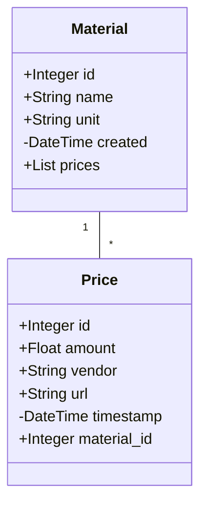
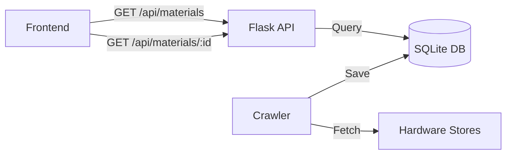

# BC-Checker (Building Material Checker)

A lightweight demo project that provides real-time price comparisons for building materials by crawling hardware store websites and serving the data through a REST API.

## Features
- Building material price comparison
- Automated price crawling
- Simple REST API

## Architecture

### Data Model


### Data Flow


## Tech Stack
- **Backend**: Python/Flask
- **Database**: SQLite with SQLAlchemy
- **Frontend**: React/TypeScript
- **Deployment**: Docker

## Installation

1. Clone repository:
```bash
git clone https://github.com/YourUsername/bc-checker.git
cd bc-checker
```

2. Create virtual environment:
```bash
cd backend
python -m venv env
source env/bin/activate  # On Windows: env\Scripts\activate
```

3. Install dependencies:
```bash
pip install -r requirements.txt
```

4. Start Docker container:
```bash
docker-compose up -d
```

## License

MIT License - see [LICENSE](LICENSE)
